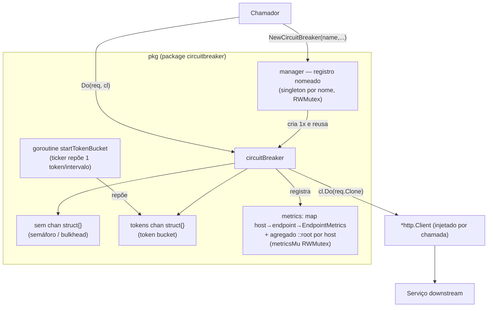
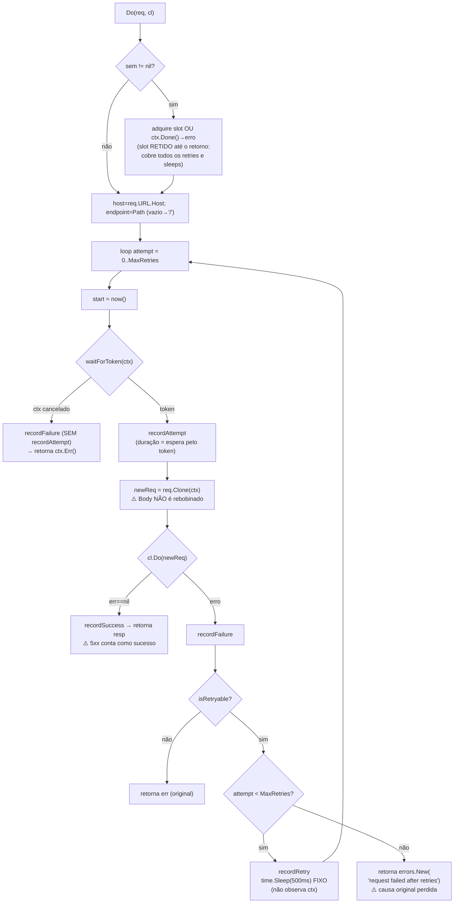

# CB.md — Circuit Breaker: Funcionamento, Arquitetura e Pontos de Melhoria

> Documento de engenharia produzido a partir de: leitura integral do código (~930 linhas de Go, 782 não-vazias, incluindo testes), execução da suíte com race detector, medição de cobertura, e **reprodução empírica** dos achados de maior severidade (repros com `-race` e benchmarks). **O contrato público do pacote é tratado como congelado**: nenhuma recomendação aqui altera assinaturas existentes. O sistema em produção não deve quebrar.

| | |
|---|---|
| **Módulo** | `github.com/diegoyosiura/circuit-breaker` (sem dependências externas — só stdlib) |
| **Pacote público** | `circuitbreaker` (diretório `pkg/`) |
| **Go** | `go.mod` declara `go 1.26.5` (atualizado em 2026-07-09, pós-revisão; era `go 1.25` na campanha); toolchain de verificação: `go1.26.5 linux/amd64` |
| **Cobertura (pkg)** | 87,3% de statements (`isRetryable` é o pior ponto: 27,3%) |
| **Releases** | tags `v0.0.1`…`v0.0.7`; `v0.0.7` == HEAD (`5e9ffe8`) |
| **Data da revisão** | 2026-07-09 |

---

## 1. Sumário executivo

O componente é sólido no que se propõe mecanicamente — bulkhead por semáforo, rate limiting por token bucket e retry, tudo sem dependências externas e com um contrato pequeno e estável — mas a revisão encontrou **dois defeitos críticos e três de alta severidade**, todos **reproduzidos empiricamente**, que têm impacto direto em produção:

1. **Data race real no subsistema de métricas (crítico).** `Metrics()` devolve um "snapshot" cujos campos slice compartilham o mesmo backing array dos dados vivos, que `repsRatio` reordena *in-place* a cada request. Um exportador de métricas iterando o snapshot concorre com o `sort` — confirmado pelo race detector. Em binário compilado com `-race`, o processo aborta; sem `-race`, há leitura corrompida de `time.Time`.

2. **Retry de POST/PUT perde o corpo (crítico).** `req.Clone` não rebobina o `Body`; após um erro transitório na 1ª tentativa, o retry parte com o reader já consumido. O desfecho bifurca (ver A2): com `Content-Length` conhecido, o transport real **aborta ruidosamente** (`"http: ContentLength=N with Body length 0"`); com corpo **chunked**, o retry envia vazio e `Do` devolve `200 OK` — **corrupção silenciosa de dados**. Confirmado empiricamente nos dois modos.

3. **`Do()` após `Stop()` bloqueia para sempre (alto).** `waitForToken` não observa o canal de parada; num shutdown gracioso com tráfego em voo, cada chamada trava indefinidamente segurando um slot do semáforo.

4. **Métricas crescem sem limite (alto).** Os slices internos nunca são podados: vazamento de memória contínuo e custo por request **superlinear** — medido de ~68 µs/req para ~530–640 µs/req (**7,3–8,6×** entre execuções) em 10 mil requests, todo esse trabalho sob o lock global que serializa todos os `Do()`.

5. **Não é um circuit breaker (alto).** Não há estados *closed/open/half-open* nem *fast-fail*: sob outage **por timeout**, o componente **amplifica** a carga (retry storm) em vez de protegê-lo, e respostas HTTP 5xx são contabilizadas como sucesso. *(Ressalva importante, validada no [CB-TESTES.md](CB-TESTES.md): contra `ECONNREFUSED`/`ECONNRESET` — serviço caído — não há amplificação, pois esses erros não são retentados; ver §6.5.)*

A boa notícia: **todas as correções são retrocompatíveis** e cabem dentro do contrato congelado (as três mais graves são mudanças pontuais em `Do()`, `Metrics()`/`repsRatio` e `waitForToken`). A §9 traz o plano priorizado; a §10, as mitigações operacionais imediatas para quem opera hoje. Os achados deste documento foram validados empiricamente em 20 cenários — ver **[CB-TESTES.md](CB-TESTES.md)**.

## 2. Escopo e método

| Etapa | O que foi feito | Resultado |
|---|---|---|
| Leitura integral | `pkg/`, `internal/`, `cmd/`, CI, README | — |
| Verificação estática | `go build ./...`, `go vet ./...` | limpos |
| Testes + race | `go test -race -count=1 ./...` | `pkg` OK; `internal` **flaky** (§7) |
| Cobertura | `go test -coverprofile -coverpkg=./pkg/... ./pkg/...` | 87,3% |
| Revisão multiagente | 6 lentes independentes (concorrência, HTTP/retry, métricas, arquitetura, testes, desempenho) | 30 achados brutos → 22 únicos |
| **Reprodução empírica** | módulo externo com `replace`, repros com `-race` e benchmarks | 5 achados de maior severidade **confirmados** |

Os repros que embasam este documento foram re-executados de forma independente; os números de desempenho se reproduzem entre execuções independentes (faixa observada: 66–84 µs/req no 1º bloco → 529–648 µs/req no 5º; razão 7,3–8,6×), o que valida cruzadamente a medição.

## 3. O que o componente é (e o que não é)

Apesar do nome, **não é o padrão Circuit Breaker de Fowler**: não há máquina de estados nem *fast-fail* quando o downstream está degradado. O que ele entrega é a composição de três padrões de resiliência mais observabilidade:

| Padrão | Mecanismo | Local |
|---|---|---|
| **Bulkhead** (limite de concorrência) | Semáforo via canal bufferizado `sem` | `circuitbreaker.go:105-113` |
| **Rate limiting** | Token bucket (`tokens`) + goroutine com ticker | `circuitbreaker.go:53-98` |
| **Retry** | Loop de até `MaxRetries` para erros transitórios | `circuitbreaker.go:121-150` |
| **Observabilidade** | Métricas agregadas por host/endpoint | `circuitbreaker.go:206-343` |

Consequência: quando o downstream cai, o componente continua enviando e **re-tentando** — o oposto de abrir o circuito. Isso está detalhado no achado **[A5](#a5)**.

## 4. Contrato público congelado

Tudo abaixo é **imutável** nesta revisão; as melhorias da §9 são estritamente aditivas.

```go
// pkg/ports_circuitbreaker.go
type ICircuitBreaker interface {
    Do(req *http.Request, cl *http.Client) (*http.Response, error)
    Stop()
    Metrics() map[string]map[string]EndpointMetrics
}

// pkg/ports_manager.go
type IManager interface {
    NewCircuitBreaker(name string, maxConcurrent, maxRequests int, windowSeconds int, maxRetries int) ICircuitBreaker
    GetCircuitBreaker(name string) ICircuitBreaker
}

func NewCircuitBreaker(name string, maxConcurrent, maxRequests int, windowSeconds int, maxRetries int) ICircuitBreaker
func NewManager() IManager
```

Também são parte do contrato os **campos exportados e tags JSON** de `EndpointMetrics` (consumidores serializam/inspecionam o retorno de `Metrics()`).

> ⚠️ **Nota de compatibilidade crítica:** em Go, **adicionar** um método a `ICircuitBreaker`/`IManager` quebra qualquer código de terceiros que implemente essas interfaces (mocks, decorators) — e o construtor devolve a *interface*, não o tipo concreto, então mocks são o caso de uso esperado. Por isso, **toda** extensão de comportamento aqui é feita via *interfaces opcionais* descobertas por type assertion, novos construtores, ou campos aditivos — nunca por alteração das interfaces existentes.

### Semântica dos parâmetros

| Parâmetro | Efeito | Valor ≤ 0 |
|---|---|---|
| `name` | Identificador (chave no Manager) | — |
| `maxConcurrent` | Capacidade do semáforo | **desativa** o limite de concorrência |
| `maxRequests` + `windowSeconds` | Capacidade do bucket e taxa (`window/maxRequests` por token) | qualquer um ≤ 0 **desativa** o rate limit |
| `maxRetries` | Re-tentativas além da inicial (total = `maxRetries + 1`) | 0 = sem retry |

## 5. Arquitetura



| Arquivo | Papel |
|---|---|
| `pkg/circuitbreaker.go` | Núcleo: semáforo, token bucket, retry, métricas |
| `pkg/manger.go` *(sic — typo de `manager.go`)* | Registro nomeado thread-safe (`map` + `RWMutex`) |
| `pkg/ports_*.go` | Interfaces públicas (`ICircuitBreaker`, `IManager`) |
| `pkg/endpoint_metrics.go` | DTO de métricas com tags JSON |
| `internal/fakeserver.go` | Servidor de bancada (delay 1–5 s) — só testes/demo |
| `cmd/main.go` | Harness de demonstração (3.000 requests) — build tag `!unittest` |

**Pontos fortes (verificados):**

- **Zero dependências externas** (`go.mod` sem `require`) — superfície de supply chain nula, forte para uma lib de resiliência.
- Limites **opcionais**: qualquer controle desliga com parâmetro ≤ 0.
- `*http.Client` **injetado por chamada** — o chamador controla transporte, TLS e timeout.
- Interfaces pequenas escondendo structs não exportadas.
- `Stop()` idempotente (`sync.Once`) com espera de shutdown da goroutine (`WaitGroup`); o **manager é thread-safe** e a **liberação do semáforo é sempre via `defer`** (sem leak de slot nesse aspecto) — ambos confirmados sob `-race`.

## 6. Funcionamento detalhado

### 6.1 Ciclo de vida

```
NewCircuitBreaker(name, maxConcurrent, maxRequests, windowSeconds, maxRetries)
 ├─ maxConcurrent > 0  → cria sem (cap = maxConcurrent)
 └─ maxRequests > 0 && windowSeconds > 0
      ├─ cria tokens (cap = maxRequests) e PRÉ-ENCHE o bucket
      ├─ intervalo = windowSeconds*1s / maxRequests   (mín. clamp 1ns)
      └─ inicia goroutine do ticker (startTokenBucket)

Stop()  (idempotente)
 ├─ sem rate limit → no-op
 └─ close(tokenStop) via sync.Once → goroutine encerra → WaitGroup.Wait()
```

### 6.2 Fluxo de `Do(req, cl)`



### 6.3 Concorrência (bulkhead)

Canal bufferizado como semáforo (`circuitbreaker.go:105-113`): enviar = adquirir, receber = liberar. A aquisição respeita `ctx.Done()`; a liberação é por `defer`, portanto **cobre toda a chamada** — incluindo espera por token, todas as tentativas e os sleeps de backoff. Um downstream lento/instável derruba o throughput efetivo bem abaixo de `maxConcurrent` (ver **[A6](#a6)**).

### 6.4 Rate limiting (token bucket)

- Bucket com capacidade `maxRequests`, **pré-enchido** na construção.
- Goroutine repõe 1 token a cada `windowSeconds/maxRequests` (reposição contínua); token que não cabe é descartado.
- Cada **tentativa** (não cada chamada a `Do`) consome 1 token; sem token, a chamada bloqueia até haver token ou o contexto expirar.

Propriedade do modelo: a taxa **sustentada** converge para `maxRequests/windowSeconds`, mas o bucket cheio permite *burst* de até `maxRequests` imediatos — na primeira janela podem passar até **~2× `maxRequests`** — **medido: 1,95–2,00×** em 4 execuções ([cenário 26](CB-TESTES.md)). É o comportamento canônico de token bucket, mas difere da promessa "max N por janela" do README.

### 6.5 Retry

Classificação em `isRetryable` (`circuitbreaker.go:184-204`):

| Condição | Retry? efetivo | Observação |
|---|---|---|
| `net.Error` com `Timeout()` ou `Temporary()==true` | ✅ | `Temporary()` está **deprecated** desde Go 1.18 |
| `net.Error` com ambos `false` (inclui **`ECONNRESET`/`ECONNREFUSED`**) | ❌ | **retorna `false` já no 1º ramo** — ver erratum abaixo |
| `os.ErrDeadlineExceeded` | ✅ | |
| Demais | ❌ | |

> ⚠️ **Erratum (validado empiricamente no [cenário 07](CB-TESTES.md) e re-verificado no Go 1.26):** ao contrário do que a intenção do código sugere, **`ECONNRESET`/`ECONNREFUSED` NÃO são retentados**. O 1º ramo (`errors.As(err, &netErr net.Error)`) captura o `*url.Error`/`*net.OpError`/`syscall.Errno` — todos implementam `net.Error` — e retorna `Temporary() || Timeout()`, que é **`false`** para conexão recusada/resetada. Assim, o `Do` retorna de imediato o erro original com **1 única chamada**. Os ramos `*net.OpError` (linhas 190-193) e `errors.Is(err, syscall.ECONNRESET) || errors.Is(err, syscall.ECONNREFUSED)` (linhas 195-197) são **código morto** — inalcançáveis, pois esses erros já satisfazem `net.Error`. O ramo `errors.Is(err, os.ErrDeadlineExceeded)` (linhas 199-201) **também é morto** (0 execuções no perfil): `os.ErrDeadlineExceeded` implementa `net.Error` com `Timeout()==true`, então o 1º ramo decide antes — o resultado efetivo (✅ retry) permanece, mas por outro caminho. Na prática, **todo o `isRetryable` abaixo da linha 188 é inalcançável**; a classificação efetiva foi mapeada em 9 casos no [cenário 24](CB-TESTES.md). Nuance adicional do cenário 24: `url.Error.Timeout()/Temporary()` usam **type-assertion direta** em `e.Err` (não `errors.As`), então um erro retryable **embrulhado com `fmt.Errorf("%w")`** dentro do transport **não** é retentado. Duas consequências: (a) o "retry storm" de **[A5](#a5)** só vale para erros com `Timeout()/Temporary()==true`, **não** para o sinal canônico de outage (serviço caído); (b) há um **bug de correção** — a intenção declarada de retentar `ECONNREFUSED` está silenciosamente anulada (é razoável não martelar serviço caído, mas o código não faz o que aparenta).

Backoff: **fixo de 500 ms** (`time.Sleep`), sem jitter, sem exponencial e **sem observar o contexto** (ver **[A6](#a6)**).

### 6.6 Métricas — semântica real

Estrutura `map[host]map[endpoint]*EndpointMetrics`, com um agregado sintético **`::root`** por host que recebe **todas** as atualizações do host (`circuitbreaker.go:287,296-297`). Tudo sob um único `RWMutex` global (`metricsMu`). **Os nomes dos campos prometem mais do que medem:**

| Campo (JSON) | O que realmente mede |
|---|---|
| `total_requests` | Nº de **tentativas** com token obtido (retries contam de novo) — não nº de `Do` |
| `successful_requests` | Tentativas com `cl.Do` sem erro **— inclui HTTP 4xx/5xx** |
| `failed_requests` | Tentativas com erro **+ cancelamentos na espera de token** → pode **exceder** `total_requests` |
| `retry_count` | Re-tentativas agendadas |
| `mean_requests` | Média das últimas 20 **esperas por token** (s) — não a duração do request |
| `mean_successful_requests` | Média das últimas 20 durações **espera-por-token + round-trip HTTP** (base diferente da de cima) |
| `ratio_01/05/10_*` | **Contagem** (não razão) de eventos iniciados nos últimos 1/5/10 **minutos** |

Matriz de contadores por cenário (uma chamada `Do`, `MaxRetries = R`):

| Cenário | total | success | failed | retry |
|---|---|---|---|---|
| Sucesso direto | 1 | 1 | 0 | 0 |
| 1 falha retryable + sucesso | 2 | 1 | 1 | 1 |
| Erro não-retryable | 1 | 0 | 1 | 0 |
| Todas as tentativas falham | R+1 | 0 | R+1 | R |
| Ctx cancelado esperando token (1ª tentativa) | **0** | 0 | **1** | 0 |

A última linha quebra a invariante `failed ≤ total` (ver **[A15](#a15)**). Mecânica interna que embasa os achados críticos: cada evento faz `append` em 2 slices do endpoint **e** do `::root`, **sem poda**; `repsRatio` **ordena in-place** o array a cada registro; `Metrics()` copia os structs por valor, mas os campos slice exportados **aliasam** os arrays vivos.

### 6.7 Manager

Registro nomeado com dupla função: `NewCircuitBreaker` é *get-or-create* (nome existente → **parâmetros ignorados em silêncio**) e `GetCircuitBreaker` devolve `nil` para nome inexistente. Thread-safe (`RWMutex`, confirmado sob `-race`). **Sem** remoção, listagem ou shutdown coletivo (ver **[A7](#a7)**, **[A8](#a8)**).

### 6.8 Ferramentas auxiliares

- **FakeServer** (`internal/`): endpoint `/teste` com delay simulado (default 1–5 s, configurável via `SetDelay`). **Corrigido em 2026-07-09** (era o [A9](#a9)): porta 0 = efêmera (N servidores simultâneos sem colisão), `Start()` síncrono propaga o erro de bind, `Addr()` expõe o endereço real, `Close()` encerra servidor e goroutines de estatística; `Listen()` mantido para compatibilidade, agora reportando erro e endereço reais.
- **cmd/main.go**: demo com 3.000 goroutines; a build tag `!unittest` é **inerte** no fluxo atual (ver **[A19](#a19)**).

## 7. Estado dos testes

**Cobertura `pkg`: 87,3%** de statements. Por função (destaques): `Metrics`/`recordX`/`updateMetrics`/`GetCircuitBreaker` 100%; `Do` 88,9%; `Stop` 80%; `waitForToken` 80%; `repsRatio` 78,6%; `manager.NewCircuitBreaker` 85,7%; **`isRetryable` 27,3%** (pior ponto).

**5 testes existentes** cobrem: caminho feliz GET, retry em erro temporário (2 falhas + sucesso), cancelamento de contexto esperando token, contadores de métricas de 1 endpoint, e create/get/nil do manager.

**Blocos com cobertura zero** (perfil): clamp de intervalo (56–58); guarda de `startTokenBucket` (75–77); cancelamento esperando slot do semáforo (109–110); retorno de erro não-retryable (141–143); erro final `"request failed after retries"` (153); modo "ilimitado" (`Stop`/`waitForToken` sem rate limit, 159–161/170–172); ramos de `isRetryable` (`OpError`, `ECONNRESET/REFUSED`, `ErrDeadlineExceeded`, 190–203); `avgLastNItens` (301–303, 305–307) e `repsRatio` (317–319, 327–328, 338–339) — o `SortFunc` (321) e o laço da janela (332–337) **são** cobertos, coerente com os 78,6%; e o ramo morto de `isRetryable` (190–203, ver §6.5); `manger.go:47-49` (nome duplicado).

**Lacunas relevantes:** limite do semáforo nunca exercido (2 requests simultâneos), exaustão de tokens sob carga, `Stop()` com `Do()` em voo, `Do()` após `Stop()`, `Metrics()` concorrente sob tráfego (`-race`), manager concorrente, esgotamento de `MaxRetries`, **POST com body em retry**, agregado `::root`, ratios de janela, média dos últimos 20, modo ilimitado.

**Teste flaky confirmado — e corrigido:** `TestFakeServer_HandlesRequests` usava **porta fixa 8081** e `time.Sleep(2s)` como sincronização; como `Listen()` engolia o erro do `ListenAndServe`, se a porta estivesse ocupada o teste consultava outro processo → **404** (reproduzido deterministicamente nesta máquina — nginx em `127.0.0.1:8081`; cenário [21]). **Correção aplicada em 2026-07-09** (T7 do [PLANO.md](PLANO.md)): porta efêmera + `Start()` com erro propagado + readiness síncrona + `Close()`; validado com 10 execuções consecutivas verdes sob `-race` com a 8081 ainda ocupada, e testes novos `MultipleServers` e `PortInUse`. Registro histórico em **[A9](#a9)**.

## 8. Achados da revisão

Severidade honesta; **V** = veredito da verificação (✅ reproduzido empiricamente por mim / 📖 confirmado por leitura de código). Todos os `suggested_fix` são **retrocompatíveis** (nenhum quebra o contrato da §4).

| # | Sev | Achado | Arquivo | V |
|---|-----|--------|---------|---|
| [A1](#a1) | 🔴 Crítico | Data race: snapshot de `Metrics()` aliasa arrays que `repsRatio` ordena in-place | `circuitbreaker.go:215,321` | ✅ `-race` |
| [A2](#a2) | 🔴 Crítico | Retry reenvia POST/PUT com **corpo vazio** e reporta sucesso | `circuitbreaker.go:130` | ✅ repro |
| [A3](#a3) | 🟠 Alto | `Do()` após `Stop()` bloqueia para sempre (sem deadline) | `circuitbreaker.go:174` | ✅ repro |
| [A4](#a4) | 🟠 Alto | Métricas crescem sem limite: leak + custo O(n)/req sob lock global | `circuitbreaker.go:226` | ✅ 7,7× |
| [A5](#a5) | 🟠 Alto | Não é circuit breaker: sem estados, amplifica outage, 5xx = sucesso | `circuitbreaker.go:20` | 📖 |
| [A6](#a6) | 🟡 Médio | Backoff fixo ignora contexto e retém o semáforo nos retries | `circuitbreaker.go:148` | ✅ repro |
| [A7](#a7) | 🟡 Médio | Manager sem `Remove`/`StopAll`/`List` → vaza goroutines de ticker | `manger.go:13` | 📖 |
| [A8](#a8) | 🟡 Médio | Manager ignora silenciosamente parâmetros divergentes | `manger.go:47` | ✅ repro |
| [A9](#a9) | 🟡 Médio | FakeServer/teste flaky: porta fixa, erro ignorado, sem shutdown | `fakeserver.go:141` | ✅ repro |
| [A10](#a10) | 🟡 Médio | `*http.Client` injetado sem salvaguarda: sem timeout trava slots | `circuitbreaker.go:133` | 📖 |
| [A11–A14](#testes) | 🟡 Médio | Lacunas de teste: semáforo, `isRetryable`, exaustão de retry, manager | — | 📖 cobertura |
| [A15](#a15) | 🔵 Baixo | Cancelamento de ctx contado como falha do endpoint (`failed > total`) | `circuitbreaker.go:124` | 📖 |
| [A16](#a16) | 🔵 Baixo | Clamp de intervalo para 1ns vira busy-loop em taxas absurdas | `circuitbreaker.go:57` | 📖 |
| [A17](#a17) | 🔵 Baixo | README diverge do código (exemplo não compila, badges, arquivo) | `README.md:77` | 📖 |
| [A18](#a18) | 🔵 Baixo | CI: actions antigas, `go mod tidy` como deps, sem `go vet` | `go.yml:20` | 📖 |
| [A19](#a19) | 🔵 Baixo | Nomes: `manger.go` (typo), alias forçado de pkg, prefixo `I` | `manger.go:1` | 📖 |
| [A20](#a20) | ⚪ Info | Contrato "congelado" mas publicado só em `v0.x` | `go.mod:1` | 📖 |

---

### Detalhamento dos achados de maior severidade

<a id="a1"></a>
#### A1 🔴 Data race em `Metrics()` — snapshot compartilha backing arrays reordenados in-place

`Metrics()` copia cada `EndpointMetrics` por valor (`endpointCopy[endpoint] = *metrics`, linha 215), mas os 8 campos slice do snapshot continuam apontando para os **mesmos arrays** dos dados vivos. A cada `recordAttempt/Success/Failure/Retry`, `repsRatio` executa `slices.SortFunc` **in-place** nesses arrays (linha 321). Um consumidor que itere `StartTime*`/`Time*` do snapshot concorre com o `sort`.

**Verificação (✅ `-race`):**
```
WARNING: DATA RACE
  slices.SortFunc[...time.Time...]()
  pkg.repsRatio()      circuitbreaker.go:321
  pkg.updateMetrics()  circuitbreaker.go:296
  ...Do()              circuitbreaker.go:128
  Previous read ...    (leitor iterando snapshot.StartTimeRequests)
```
**Impacto:** binário com `-race` **aborta** em produção; sem `-race`, leitura *torn* de `time.Time` (struct de 3 palavras) → valores corrompidos. Simetricamente, o caller pode mutar o snapshot e corromper os dados vivos.

**Correção retrocompatível:** (a) em `Metrics()`, `slices.Clone` de cada campo slice antes de inserir no snapshot; **e** (b) eliminar o `sort` in-place em `repsRatio` — a contagem de janela não precisa de ordenação: uma varredura O(n) contando `t.After(cutoff)` dá o mesmo resultado sem tocar o array (ou ordenar uma cópia). Fazer **(a) e (b)** resolve a race e ainda melhora desempenho ([A4](#a4)).

<a id="a2"></a>
#### A2 🔴 Retry reenvia POST/PUT com corpo vazio e reporta sucesso

O comentário na linha 129 diz "Clone the request to avoid reuse issues with Body on retries", mas `http.Request.Clone` copia o **mesmo** `io.ReadCloser` — não chama `GetBody`. Na 1ª tentativa o transporte consome o reader; no retry o corpo vai vazio.

**Verificação (✅ repro):** POST com `"PAYLOAD-123"` + erro transitório retentável (timeout) na 1ª tentativa →
```
tentativas vistas pelo servidor: ["PAYLOAD-123" ""] | GetBody nil? false | err=<nil>
CONFIRMADO: retry recebeu corpo VAZIO
```
**Impacto:** um POST/PUT com corpo que sofra um erro **retentável** (timeout; **não** `ECONNRESET`/`ECONNREFUSED`, que não são retentados — ver §6.5) tem o corpo perdido no retry. **O modo de falha bifurca** (precisado nos cenários [01](CB-TESTES.md) do CB-TESTES.md): com corpo de comprimento **conhecido** (`strings.Reader`/`bytes.Reader`/`Buffer`, o caso dominante), um `http.Transport` real **aborta ruidosamente** com `"http: ContentLength=N with Body length 0"` e `Do()` retorna `(nil, erro)` — falha alto e visível; com corpo **chunked** (comprimento desconhecido), o retry envia corpo vazio e `Do()` retorna `(200, nil)` — **corrupção silenciosa de dados**. Em ambos os casos `GetBody` **estava disponível**, ou seja, a correção é barata. *(O repro acima usa um `RoundTripper` mock que não valida `Content-Length`, por isso mostra sucesso; contra transport real com corpo de tamanho conhecido a falha seria dura — mas o bug-raiz de perda de corpo é o mesmo.)*

**Correção retrocompatível:** antes de cada tentativa `>0`, se `req.GetBody != nil` fazer `newReq.Body, err = req.GetBody()` (preenchido automaticamente por `http.NewRequest` para `strings.Reader`/`bytes.Reader`/`bytes.Buffer`); se `Body != nil` e `GetBody == nil`, **não** re-tentar (devolver o erro), pois o corpo não é rebobinável.

<a id="a3"></a>
#### A3 🟠 `Do()` após `Stop()` bloqueia para sempre

`Stop()` encerra a goroutine repositora, mas `waitForToken` seleciona apenas `ctx.Done()` e `cb.tokens` (linhas 174-179) — não há caso para `cb.tokenStop`. Esgotados os tokens remanescentes, todo `Do()` com `context.Background()` bloqueia indefinidamente, **segurando um slot do semáforo** e estrangulando os próximos callers.

**Verificação (✅ repro):** token inicial consumido → `Stop()` → `Do()` com `context.Background()` bloqueou **>2 s** sem retornar (goroutine vazada).

**Impacto:** shutdown gracioso com workers ainda emitindo requests → goroutines penduradas para sempre; o processo não drena e precisa de `SIGKILL`.

**Correção retrocompatível:** adicionar `case <-cb.tokenStop: return errors.New("circuit breaker stopped")` ao `select` de `waitForToken` (canal fechado desbloqueia todos os waiters). `Do()` já devolve `(nil, error)` no contrato.

<a id="a4"></a>
#### A4 🟠 Métricas sem poda: leak de memória + custo O(n) por request

Cada tentativa faz `append` em `Time*`/`StartTime*` do endpoint **e** do `::root` (`updateFn` aplicado duas vezes), e **nada é podado**. `repsRatio` ordena/percorre os arrays inteiros e `avgLastNItens` soma a cauda a cada request — tudo sob `metricsMu.Lock()`, que **serializa todos os `Do()`** do breaker.

**Verificação (✅ medição):**
```
bloco 0 (reqs    0- 2000):  68.4 µs/req
bloco 1 (reqs 2000- 4000): 181.7 µs/req
bloco 2 (reqs 4000- 6000): 301.1 µs/req
bloco 3 (reqs 6000- 8000): 420.4 µs/req
bloco 4 (reqs 8000-10000): 528.7 µs/req   → fator 7.7×
len(StartTimeRequests) após 10000 reqs = 10000 (nunca podado)
```
**Impacto:** a 50 req/s por breaker, ~4,3 M entradas por slice por nível em 24 h; RSS cresce continuamente (OOM eventual) e cada `Do()` gasta milissegundos ordenando o histórico sob o lock — o throughput desaba muito abaixo do rate limit configurado.

**Correção retrocompatível:** podar dentro de `updateMetrics` — os agregados só precisam dos **últimos 20 itens** (`avgLastNItens` usa `size=20`) e das entradas dos **últimos 10 min** (maior janela de `repsRatio`). Manter os slices como buffers limitados. Os campos exportados (contadores/médias/ratios) preservam a semântica; os slices têm tag `json:"-"` e não entram na serialização. Combina com a remoção do `sort` de [A1](#a1).

<a id="a5"></a>
#### A5 🟠 Não é um circuit breaker — amplifica carga sob outage

Não há estado *open* nem *fast-fail*. Sob outage por **erro transitório retentável** (timeout de resposta, `net.Error` com `Timeout()/Temporary()==true`), cada chamada segura um slot, consome **um token por tentativa** (`waitForToken` está dentro do loop) e dorme 500 ms fixos entre retries — com `maxRetries=5`, até 6 tokens e ~2,5 s de slot por chamada. Além disso, **5xx conta como sucesso** (`if err == nil { recordSuccess; return }`, linhas 134-136: `cl.Do` só devolve erro para falhas de rede, não para status HTTP). Quem adota pela promessa do nome (proteção contra falha em cascata) obtém **retry storm**.

> ⚠️ **Correção validada (cenários [06](CB-TESTES.md) e [07](CB-TESTES.md)):** o retry storm **só** ocorre para erros com `Timeout()/Temporary()==true` — foi medido em 6 tentativas para um timeout genuíno. Para **conexão recusada/resetada** (`ECONNREFUSED`/`ECONNRESET`, o sinal típico de "serviço caído"), `isRetryable` retorna `false` e há **1 única chamada** (ver erratum na §6.5). Ou seja: contra um downstream que recusa conexão o componente *não* amplifica; contra um downstream *lento* (que causa timeouts) ele amplifica. O achado **5xx=sucesso** foi reproduzido separadamente (cenário 06): `SuccessfulRequests=1`, `FailedRequests=0` para uma resposta 500.

**Impacto:** downstream *lento* (timeouts) recebe rajada ~6× maior; tokens do host esgotam para todos os endpoints; nenhum chamador recebe *fast-fail* para acionar fallback; métricas não capturam a degradação HTTP (5xx entra como sucesso). A ausência de fast-fail foi **demonstrada diretamente** ([cenário 25](CB-TESTES.md)): após 10 falhas consecutivas, a 11ª chamada ainda atinge o transport (contador 10→11) — nenhum curto-circuito em nenhum ponto.

**✅ Implementado (2026-07-09, opt-in inerte por default)** na branch `refactor/optimizations`: máquina closed/open/half-open com fast-fail (`WithBreaker` → `ErrCircuitOpen`), `StateReporter` por type assertion, 5xx como falha (`WithStatusCodeFailure`), política de retry configurável (`WithRetryPolicy`), backoff exponencial com jitter (`WithExponentialBackoff`) — tudo via `NewCircuitBreakerWithOptions`; sem opções, comportamento idêntico ao clássico (provado por teste de inércia). O caminho abaixo fica como registro do desenho.

**Caminho de evolução (100% aditivo, sem tocar `ICircuitBreaker`):** máquina de estados *closed/open/half-open* alimentada pelas métricas já coletadas (`FailedRequests`/`Ratio01FailedRequests`); *fast-fail* **opt-in** via novo construtor/opções (mantendo `NewCircuitBreaker` idêntico); estado exposto por **interface opcional** (`type StateReporter interface { State() ... }`) descoberta por type assertion e/ou campo novo em `EndpointMetrics` (`omitempty`); erro sentinela novo `var ErrCircuitOpen = errors.New(...)` para `errors.Is`; backoff exponencial com jitter configurável (default 500 ms). **Curto prazo:** corrigir o README para descrever o componente como *bulkhead + rate-limiter + retry* e documentar a ausência de estados.

<a id="a6"></a>
#### A6 🟡 Backoff fixo ignora o contexto e retém o semáforo

`time.Sleep(500ms)` (linha 148) não observa `req.Context()`, e o slot do semáforo é retido do início ao fim de `Do()` (`defer`, linha 112).

**Verificação (✅ repro):** com `cancel()` em ~50 ms, `Do()` só retornou após **1,5 s** — os sleeps não observam o cancelamento.

**Impacto:** um request cancelado ainda dorme até 500 ms por tentativa; sob outage com erro **retentável** que falha rápido (ex.: `net.Error` transitório instantâneo), cada `Do()` ocupa um slot por ≥ `MaxRetries×500ms` só de sleeps, bloqueando na entrada inclusive requests para hosts saudáveis (o semáforo é por breaker, não por host). *(`ECONNREFUSED` não se enquadra: não é retentado — §6.5 — logo libera o slot de imediato.)* Reproduzido nos cenários [08](CB-TESTES.md) (cancelamento não interrompe o sleep) e [09](CB-TESTES.md) (2ª chamada espera a 1ª liberar o slot).

**Correção retrocompatível:** `select { case <-req.Context().Done(): return nil, req.Context().Err(); case <-time.After(500*time.Millisecond): }` (idealmente com timer reutilizado). Opcional: backoff exponencial com jitter.

<a id="a7"></a>
#### A7 🟡 Manager sem ciclo de vida — vazamento de goroutines

Cada breaker com rate limit carrega uma goroutine de ticker perpétua que só termina via `Stop()` individual. O manager nunca remove entradas e `IManager` não expõe `List`/`Remove`/`StopAll`. Com nomes dinâmicos (por tenant/host/rota), goroutines e mapas de métricas (já sem poda, [A4](#a4)) acumulam pela vida do processo; no shutdown, não há como parar tudo pelo manager. *(O doc comment promete "Centralized lifecycle management" que não existe.)*

**Correção retrocompatível:** implementar no tipo concreto `List() []string`, `Remove(name string)` (chamando `Stop()` antes do `delete`) e `StopAll()`, expostos via **interface opcional nova** (`IManagerLifecycle`) obtida por type assertion de `IManager`. **Não** adicionar métodos a `IManager`.

<a id="a8"></a>
#### A8 🟡 Manager ignora silenciosamente parâmetros divergentes

Se o nome já existe, os 4 parâmetros são descartados sem erro/log. **Verificação (✅ repro):** `NewCircuitBreaker("svc",1,1,60,0)` seguido de `NewCircuitBreaker("svc",100,1000,1,5)` devolve a **mesma** instância com a **primeira** config. Em processos com múltiplos módulos inicializando o mesmo nome (ordem de init não determinística), a config efetiva depende de quem chamou primeiro. A assinatura atual não permite retornar erro.

**Correção retrocompatível:** (1) documentar o `get-or-create`; (2) adicionar no tipo concreto um `NewCircuitBreakerStrict(...) (ICircuitBreaker, error)` que retorna erro em config divergente (guardando a config original), exposto por interface opcional. `IManager` intacta.

<a id="a9"></a>
#### A9 🟡 FakeServer/teste flaky: porta fixa, erro ignorado, sem shutdown

`Listen()` descarta o erro de `ListenAndServe` (linha 141) e imprime `localhost:8080` fixo; `reset()`/`stats()` são loops infinitos sem parada; o teste usa porta fixa **8081** e `time.Sleep(2s)`. **Verificação (✅ repro):** com outro processo em `127.0.0.1:8081`, o bind falha em silêncio e o GET recebe **404**. Reconfirmado ao vivo na rodada Fable ([cenário 21](CB-TESTES.md)): porta ocupada por um nginx local → `TestFakeServer_HandlesRequests` falha deterministicamente em 2,02 s com `Expected status 200, got 404`, e o mecanismo (erro `EADDRINUSE` descartado + resposta do processo alheio) foi isolado em teste próprio. O CI (`go test -race ./...`) inclui `./internal`, herdando a flakiness. Impacto restrito a testes/CI, mas CI vermelho intermitente bloqueia merges.

**Correção (pacote `internal/`, fora do contrato):** ✅ **APLICADA em 2026-07-09** — `net.Listen` com porta 0 (efêmera, N servidores em paralelo), `Start() error` síncrono (bind falho vira erro, não silêncio), `Addr()` com o endereço real, `Close()` idempotente encerrando servidor + goroutines `reset`/`stats` (done-channel), `SetDelay` para testes rápidos; `Listen()` preservado para o `cmd/main.go`. Teste reescrito sem porta fixa nem sleep + testes novos de múltiplos servidores e de porta ocupada.

<a id="a10"></a>
#### A10 🟡 `*http.Client` injetado sem salvaguarda

O design por chamada é flexível, mas o breaker não se protege: com `http.DefaultClient` (`Timeout == 0`) e request sem deadline, `cl.Do` pode bloquear para sempre num servidor que aceita a conexão e não responde — a goroutine fica presa **segurando o slot** (`defer` da linha 112 nunca roda). Com `maxConcurrent` slots travados, todo o tráfego do breaker congela. Bônus: `cl == nil` causa panic.

**Correção retrocompatível em camadas:** (1) documentar em `Do`/README que o chamador **deve** fornecer client com `Timeout` ou request com deadline; (2) tratar `cl == nil` usando `http.DefaultClient` em vez de panic; (3) *opt-in* aditivo: construtor/opção com `defaultTimeout` que, **apenas** quando `cl.Timeout == 0` **e** o request não tem deadline, envolve o contexto com `context.WithTimeout`. Não impor timeout silenciosamente no caminho atual.

<a id="testes"></a>
#### A11–A14 🟡 Lacunas de teste de funcionalidades centrais

Cada item é uma regressão que passaria **verde** hoje. Propostas (todas white-box ou externas, sem mudar contrato):

- **A11 — Semáforo nunca exercido** (109–110 = 0%): `TestCircuitBreaker_MaxConcurrentEnforced` — `httptest` com handler que segura em canal; N > `maxConcurrent` goroutines; contador atômico de em-voo assevera pico ≤ `maxConcurrent`; subteste de ctx cancelado com semáforo cheio.
- **A12 — `isRetryable` 27,3%**: teste de tabela (`package circuitbreaker`) com `*net.OpError`, `ECONNRESET`, `ECONNREFUSED`, `os.ErrDeadlineExceeded`, `net.Error{Timeout}`, erro genérico e erros embrulhados com `%w`.
- **A13 — Exaustão de retry** (153 = 0%): `TestCircuitBreaker_RetriesExhausted` — transport sempre falho, `MaxRetries=2`; assevera mensagem exata, `attempts==3`, `FailedRequests==3`, `RetryCount==2`; subteste de erro não-retryable (141–143). *Nota:* o backoff fixo torna o teste lento — sugere-se tornar o backoff um **campo interno injetável** para teste (não muda o contrato público).
- **A14 — Manager dedup/concorrência** (`manger.go:47-49` = 0%): `TestManager_ReusesInstanceOnDuplicateName` (mesmo ponteiro com params diferentes) e `TestManager_ConcurrentNewAndGet` (50 goroutines sob `-race`); adicionar `t.Cleanup(cb.Stop)` ao teste existente (que hoje vaza a goroutine do ticker).

<a id="a15"></a>
#### A15 🔵 Cancelamento de ctx contado como falha do endpoint

Quando `waitForToken` retorna `ctx.Err()`, `Do()` chama `recordFailure` **sem** `recordAttempt` (linha 124) — `FailedRequests` pode exceder `TotalRequests`, e cancelamentos/timeouts locais do caller inflam `Failed*` do endpoint como se fossem falhas remotas. **Correção:** contabilizar cancelamentos em contador próprio ou não chamar `recordFailure` nesse caminho; escolher e documentar a semântica. Campos exportados não mudam.

<a id="a16"></a>
#### A16 🔵 Clamp de intervalo para 1ns → busy-loop

Se `(windowSeconds*time.Second)/maxRequests` trunca para 0 (i.e. `maxRequests > windowSeconds×1e9`; com igualdade exata o intervalo já é 1ns sem precisar do clamp), o código força `interval = 1ns` e `time.NewTicker(1ns)` vira loop quente. **Medido ([cenário 22](CB-TESTES.md)):** com o breaker **ocioso**, a goroutine do refiller consome **~100% de 1 core** (100,3% via `Getrusage`, **815×** o controle de intervalo normal, ~12,5% da máquina de 8 cores), permanentemente, cessando só com `Stop()`. Dois efeitos colaterais adicionais medidos: o construtor gasta **~13–27 s** só pré-enchendo o bucket (loop de `maxRequests` sends: 13,4 s para 1e9, 26,8 s para 2e9), e o rate limit fica **efetivamente anulado** — não pelo refill, mas pelo **bucket pré-preenchido** com `maxRequests` tokens (a ~24k req/s de vazão real, drená-lo levaria ~23 h; `waitForToken` jamais bloqueia — [cenário 14](CB-TESTES.md)). Edge case de config absurda, sem validação. **Correção:** clampar o intervalo para um mínimo prático (ex.: 1 ms) repondo múltiplos tokens por tick, e limitar/validar a capacidade do bucket para configs degeneradas. Configs válidas não mudam.

<a id="a17"></a>
#### A17 🔵 README diverge do código

O exemplo principal chama `cb.Do(req)` com 1 argumento (a assinatura exige `Do(req, cl)`) — **não compila** (comprovado no [cenário 27](CB-TESTES.md): `go build` falha com `not enough arguments in call to cb.Do`; a versão literal falha antes ainda, em `use of internal package ... not allowed`). Também: badge de coverage aponta `your-org/your-repo`; a seção Manager cita `pkg/manager.go` (o arquivo é `manger.go`); o exemplo usa `internal.NewFakeServer` (não importável por terceiros); a descrição de abertura (linha 8 do README) vende "fully-featured Circuit Breaker" ([A5](#a5)). **Correção:** alinhar o exemplo à assinatura real (com `cl := &http.Client{Timeout: ...}`), corrigir badge/arquivo, trocar o FakeServer por `httptest.Server`. Só documentação.

<a id="a18"></a>
#### A18 🔵 Higiene de CI

`actions/setup-go@v4` e `codecov-action@v3` desatualizadas; `go mod tidy` como passo de "Install dependencies" **reescreve** `go.mod`/`go.sum` em vez de validar (mascarará dessincronização quando entrar uma dependência); `go-version: '1.25'` hardcoded duplica o `go.mod` — **divergência já materializada**: o `go.mod` agora exige `go 1.26.5`, e o CI só passa porque o `GOTOOLCHAIN=auto` baixa o toolchain em runtime (exatamente a fragilidade prevista); não há `go vet`. *(Verificado: o `grep -v '/cmd'` só afeta o `coverpkg`; `go test ./...` compila `cmd/` normalmente — não há gap de compilação.)* **Correção:** `setup-go@v5` com `go-version-file: go.mod`, `codecov-action@v4+`, trocar deps por `go mod download` + `go mod tidy && git diff --exit-code go.mod go.sum`, adicionar `go vet ./...`.

<a id="a19"></a>
#### A19 🔵 Nomes: `manger.go`, alias de pkg, prefixo `I`

`manger.go` é typo de `manager.go` (invisível ao import, mas atrapalha busca e já contaminou o README). O pacote `circuitbreaker` vive em `pkg/`, então o import path termina em `/pkg` e exige alias — e o repositório é inconsistente (`manager_test.go` importa sem alias, os demais com). Prefixo `I` (`ICircuitBreaker`) não é idiomático em Go. **Correção retrocompatível agora:** renomear `manger.go → manager.go` (mesmo pacote, zero impacto); padronizar o alias nos testes. **Aditivo para o alias:** criar pacote na **raiz** do módulo com type aliases (`type ICircuitBreaker = pkg.ICircuitBreaker`) e forwards (`var NewManager = pkg.NewManager`), permitindo import limpo sem quebrar quem já usa `/pkg`. Renomear interfaces/mover o path: só em v2. A build tag `!unittest` de `cmd/main.go` é **inerte** (nem CI nem comandos locais passam `-tags unittest`) — escolher um único mecanismo (remover a tag **ou** padronizar `-tags`).

<a id="a20"></a>
#### A20 ⚪ Contrato "congelado" mas publicado só em `v0.x`

Existem tags `v0.0.1`…`v0.0.7` e `v0.0.7 == HEAD` (releases atuais — bom), e `go.mod` sem dependências (forte). Mas, por SemVer/Go modules, **toda** versão `0.x` comunica "API instável", o oposto do status real. Nada no versionamento impede um commit futuro de quebrar a API sem sinal de *major*. **Correção:** taggear **`v1.0.0`** no commit atual para formalizar o congelamento (aditivo); a partir daí, mudanças de contrato exigem `/v2` no module path. Documentar a política de compatibilidade.

## 9. Plano de melhoria priorizado (sem quebra de contrato)

**P0 — corrigir já (bugs confirmados com impacto em produção):**

1. **[A1] Data race das métricas** — `slices.Clone` no snapshot de `Metrics()` **e** remover o `sort` in-place de `repsRatio` (varredura O(n)). Resolve a race e ataca [A4].
2. **[A2] Corpo perdido no retry** — rearmar `newReq.Body` via `GetBody` por tentativa; sem `GetBody`, não re-tentar.
3. **[A3] Hang pós-`Stop()`** — `case <-cb.tokenStop` em `waitForToken`.
4. **[A4] Poda das métricas** — descartar entradas > 10 min e limitar os buffers a ~20 itens úteis.

**P1 — resiliência e robustez:**

5. **[A6]** backoff que observa o contexto (+ exponencial/jitter opcional).
6. **[A10]** `cl == nil` → `http.DefaultClient`; documentar exigência de timeout; `defaultTimeout` opt-in.
7. **[A8]** `NewCircuitBreakerStrict` (erro em config divergente) via interface opcional.
8. **[A7]** `List`/`Remove`/`StopAll` no manager via interface opcional.
9. **[A11–A14]** fechar as lacunas de teste (semáforo, `isRetryable`, exaustão de retry, manager concorrente) e o **teste de regressão de [A2]** (`RetryReplaysPostBody`) e de [A1] (`MetricsConcurrentWithTraffic` sob `-race`).

**P2 — evolução para circuit breaker de verdade ([A5]), tudo aditivo:**

10. Máquina de estados *closed/open/half-open* alimentada pelas métricas; *fast-fail* opt-in; `StateReporter` + campo `State` em `EndpointMetrics`; `ErrCircuitOpen`. Tratar 5xx como falha (configurável).

**P3 — higiene e documentação:**

11. **[A9]** `httptest`/porta efêmera no FakeServer; **[A17]** README; **[A18]** CI; **[A19]** `manger.go → manager.go` + pacote raiz com aliases; **[A16]** clamp de intervalo; **[A15]** semântica de cancelamento; **[A20]** taggear `v1.0.0`.

## 10. Riscos operacionais imediatos e mitigações (antes de mexer no código)

Para quem **opera a versão atual em produção hoje**, sem esperar as correções:

- **Não compile o binário de produção com `-race`** enquanto [A1] não for corrigido — o detector aborta o processo ao primeiro acesso concorrente ao snapshot. Se algum coletor de métricas itera os slices de `Metrics()`, **pare de iterar `StartTime*`/`Time*`** (use só os contadores/médias/ratios, que são cópias por valor seguras).
- **Não habilite retry (`maxRetries > 0`) para POST/PUT com corpo** até [A2] — o retry corrompe o payload silenciosamente. Para métodos com corpo, use `maxRetries = 0` ou trate a idempotência na camada acima.
- **No shutdown, chame `Stop()` somente após drenar o tráfego** e garanta que os requests em voo tenham **deadline no contexto** (nunca `context.Background()`), senão travam ([A3]).
- **Reinicie periodicamente** processos de longa duração, ou monitore RSS/latência por breaker, até [A4] — memória e custo por request crescem sem teto.
- **Sempre passe `*http.Client` com `Timeout`** (como em `cmd/main.go:55`), nunca `http.DefaultClient` ([A10]).
- **Trate 5xx no chamador**: `err == nil` não significa resposta bem-sucedida — inspecione `resp.StatusCode` ([A5]).

## Apêndice — Evidências de reprodução

Repros executados em módulo externo com `replace` para o repositório (nada no repo foi modificado). Resumo dos vereditos:

| Achado | Comando | Saída-chave |
|---|---|---|
| A2 | `go test -run RetryPostBodyLost` | servidor viu `["PAYLOAD-123" ""]`, `cb.Do` → sucesso |
| A1 | `go test -race -run MetricsSnapshotRace` | `WARNING: DATA RACE` em `repsRatio` (`circuitbreaker.go:321`) vs leitor do snapshot |
| A3 | `go test -run DoAfterStopBlocks` | `Do()` pós-`Stop()` bloqueou >2 s |
| A4 | `go test -run PerRequestCostGrowth` | 68,4 → 528,7 µs/req (7,7×); `len=10000` |
| A6 | `go test -run BackoffIgnoresContext` | cancel em 50 ms → retorno em 1,5 s |
| contraste | `go test -race -run ManagerConcurrentClean` | **sem** race (manager e `Stop` concorrentes são seguros) |
