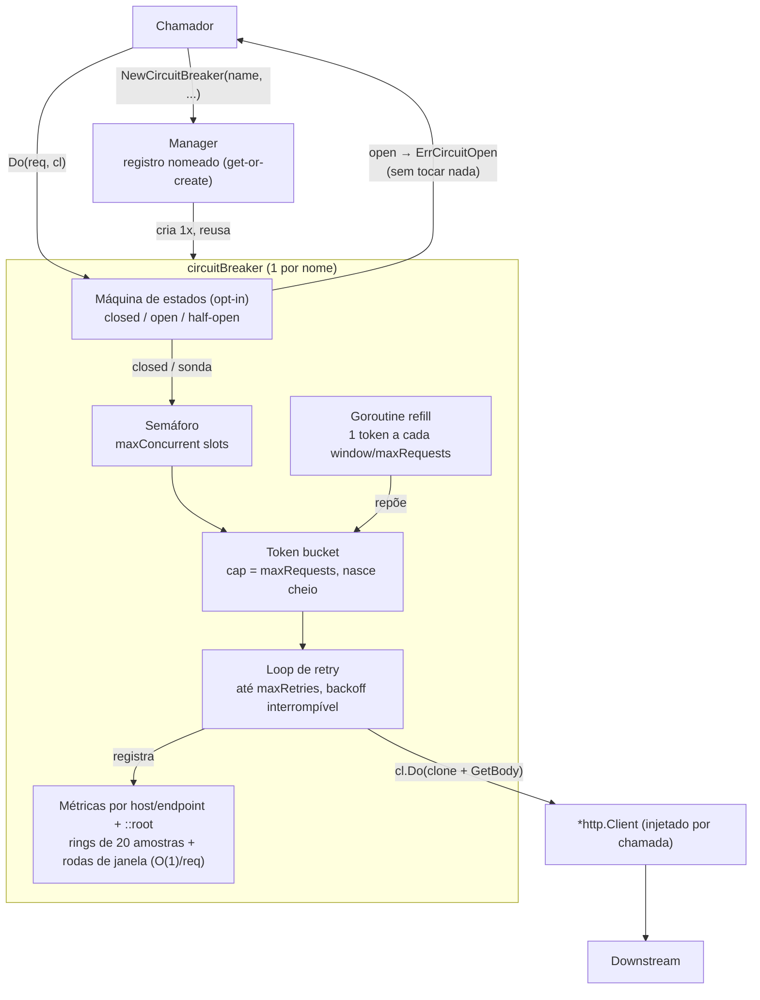
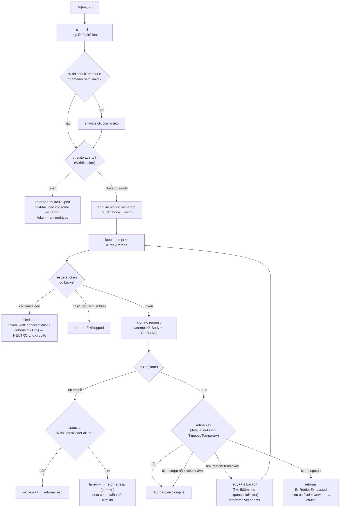
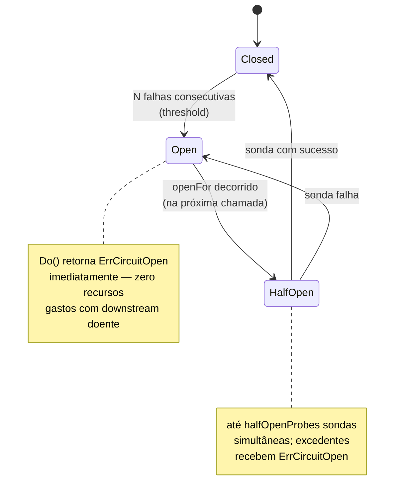
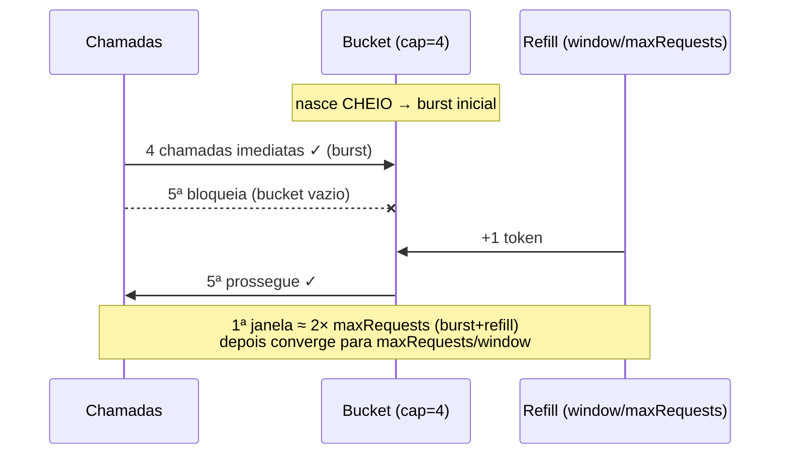

# Circuit Breaker (Go)


Cliente HTTP resiliente, **sem dependências externas** (só stdlib), que compõe quatro camadas de proteção:

| Camada | Mecanismo | Default |
|---|---|---|
| **Bulkhead** | Semáforo de requisições simultâneas | opcional (`maxConcurrent > 0`) |
| **Rate limiting** | Token bucket com burst + reposição contínua | opcional (`maxRequests/windowSeconds > 0`) |
| **Retry** | Re-tentativas para erros transitórios, com corpo rebobinado via `GetBody` | opcional (`maxRetries > 0`) |
| **Circuit breaker** | Estados *closed/open/half-open* com fast-fail (`ErrCircuitOpen`) | **opt-in** (`WithBreaker`) |

Mais **métricas por host/endpoint** (contadores, médias móveis, contagens por janela) com agregado `::root` por host, e um **Manager** para registro nomeado de instâncias.

---

## ⚡ Quick setup

```bash
go get github.com/diegoyosiura/circuit-breaker
```

```go
package main

import (
	"errors"
	"fmt"
	"net/http"
	"time"

	circuitbreaker "github.com/diegoyosiura/circuit-breaker" // raiz — sem alias manual
)

func main() {
	// name, maxConcurrent, maxRequests, windowSeconds, maxRetries
	cb := circuitbreaker.NewCircuitBreakerWithOptions("minha-api", 50, 200, 30, 3,
		circuitbreaker.WithBreaker(5, 30*time.Second, 2), // circuito de verdade (opcional)
		circuitbreaker.WithStatusCodeFailure(500),        // 5xx conta como falha (opcional)
	)
	defer cb.Stop()

	cl := &http.Client{Timeout: 10 * time.Second} // SEMPRE dê um Timeout ao client
	req, _ := http.NewRequest(http.MethodGet, "https://example.com/dados", nil)

	resp, err := cb.Do(req, cl)
	switch {
	case errors.Is(err, circuitbreaker.ErrCircuitOpen):
		fmt.Println("circuito aberto — downstream doente, use o fallback")
	case err != nil:
		fmt.Println("erro:", err)
	default:
		defer resp.Body.Close()
		fmt.Println("ok:", resp.Status) // atenção: 4xx/5xx chegam aqui com err == nil
	}
}
```

Sem as opções, `NewCircuitBreaker("minha-api", 50, 200, 30, 3)` dá o comportamento clássico (bulkhead + rate limit + retry, sem máquina de estados). Os dois imports são equivalentes — os tipos são *aliases* idênticos:

```go
import circuitbreaker "github.com/diegoyosiura/circuit-breaker/pkg" // path histórico
import "github.com/diegoyosiura/circuit-breaker"                    // raiz
```

---

## Como funciona

### Arquitetura



### Fluxo de uma chamada `Do(req, cl)`



### Máquina de estados (opt-in via `WithBreaker`)



O que conta como **falha** para o circuito: erro de transporte devolvido por `Do` (exceto cancelamento explícito) e, com `WithStatusCodeFailure(min)`, respostas com status ≥ min. **Neutros** (não abrem o circuito): `context.Canceled` em qualquer ponto — inclusive com a requisição **em voo** (cancelar é ação do chamador, não evidência sobre o downstream) —, `ErrStopped` e erros locais (ex.: `GetBody` falhou). Exceção deliberada: deadline que estoura **após falhas reais de transporte** na mesma chamada conta como falha (downstream falhando e lento). Panic no transporte propaga e conta como falha. Sucesso zera a contagem de falhas consecutivas.

### Token bucket



Propriedades: a espera por token respeita o contexto; após `Stop()`, sobras do bucket ainda atendem e depois as chamadas recebem `ErrStopped`; taxas acima de 1000 req/s usam reposição em lote (tick de 25 ms) sem perder a taxa nominal; configurações degeneradas (`maxRequests > 1e6`) têm a capacidade clampada e o construtor permanece instantâneo.

---

## Configuração

### Parâmetros posicionais (contrato clássico)

| Parâmetro | Efeito | Valor ≤ 0 |
|---|---|---|
| `name` | Identificador (chave no Manager) | — |
| `maxConcurrent` | Máximo de requisições simultâneas | desativa o bulkhead |
| `maxRequests` + `windowSeconds` | Capacidade do bucket e taxa de reposição | qualquer um ≤ 0 desativa o rate limit |
| `maxRetries` | Re-tentativas além da inicial (total = `maxRetries+1`) | 0 = sem retry |

### Opções (`NewCircuitBreakerWithOptions` — todas opt-in, default inerte)

| Opção | Liga | Sem ela |
|---|---|---|
| `WithBreaker(threshold, openFor, probes)` | Estados closed/open/half-open + fast-fail `ErrCircuitOpen` | nunca fast-faila |
| `WithStatusCodeFailure(min)` | Status ≥ min conta como falha (métricas + circuito); a resposta ainda é devolvida com `err == nil` | 4xx/5xx contam como sucesso |
| `WithRetryPolicy(fn)` | Classificação de retry customizada | só `net.Error` com `Timeout()`/`Temporary()` |
| `WithExponentialBackoff(base, max, jitter)` | Espera `min(max, base·2ⁿ)`, jitter em `[d/2, d)` | 500 ms fixo |
| `WithDefaultTimeout(d)` | Teto de duração **apenas** quando `cl.Timeout == 0` **e** o request não tem deadline | sem teto (pode esperar para sempre) |

### Semântica efetiva de retry (default)

| Erro | Retenta? |
|---|---|
| `net.Error` com `Timeout()` ou `Temporary()` (timeouts genuínos, `os.ErrDeadlineExceeded`) | ✅ |
| `ECONNREFUSED` / `ECONNRESET` (serviço caído) | ❌ deliberado — não martelamos downstream morto |
| Erro retryable embrulhado com `fmt.Errorf("%w", ...)` dentro do transport | ❌ (`url.Error` sonda por type-assertion direta) |
| Erro genérico | ❌ |
| Corpo não-rebobinável (`GetBody == nil`) após falha retryable | ❌ devolve o erro da tentativa |

## Manager

```go
m := circuitbreaker.NewManager()
cb := m.NewCircuitBreaker("svc", 10, 100, 60, 2) // get-or-create: nome existente IGNORA os params
_ = m.GetCircuitBreaker("svc")                   // nil se não existir

if st, ok := m.(circuitbreaker.IManagerStrict); ok {
	_, err := st.NewCircuitBreakerStrict("svc", 99, 9, 9, 9) // erro: config divergente
	_ = err
}
if lc, ok := m.(circuitbreaker.IManagerLifecycle); ok {
	_ = lc.List()    // nomes registrados
	lc.Remove("svc") // Stop() + desregistro
	lc.StopAll()     // shutdown gracioso (idempotente)
}
```

`IManagerLifecycle` e `IManagerStrict` são interfaces **opcionais** (type assertion) — `IManager` é contrato congelado.

## Métricas

`cb.Metrics()` devolve um snapshot **imutável** — `map[host]map[endpoint]EndpointMetrics`, mais a chave `::root` agregando cada host. Custo interno O(1) por request (rings de 20 amostras + rodas de buckets de 1 s).

| Campo (JSON) | O que mede |
|---|---|
| `total_requests` | Tentativas que obtiveram token (cada retry conta) |
| `successful_requests` | Tentativas sem erro de transporte (inclui 4xx/5xx, salvo `WithStatusCodeFailure`) |
| `failed_requests` | Tentativas com erro + cancelamentos na espera de token (**pode exceder** `total_requests`) |
| `retry_count` | Re-tentativas agendadas |
| `token_wait_cancellations` | Contextos cancelados/expirados esperando token (cancelamento local ≠ falha remota) |
| `mean_requests` | Média das últimas 20 esperas por token (s) |
| `mean_successful_requests` / `mean_failed_requests` / `mean_retry_count` | Média das últimas 20 durações espera+round-trip (s) |
| `ratio_01/05/10_*` | **Contagem** de eventos nos últimos 1/5/10 min (calculada no registro; "stale" até o próximo evento) |

Os campos `Time*`/`StartTime*` (tag `json:"-"`) expõem as últimas ≤20 amostras. A cardinalidade de endpoints por host é limitada (~1k); paths únicos excedentes (ex.: `/user/{id}` sem normalização) agregam na chave `::other`.

## Erros sentinela

| Sentinela | Quando | Como tratar |
|---|---|---|
| `ErrCircuitOpen` | Circuito aberto ou sondas esgotadas (só com `WithBreaker`) | fallback imediato; o downstream não foi tocado |
| `ErrStopped` | `Do()` após `Stop()` com bucket esgotado | instância encerrada; não re-tente nela |
| `ErrRetriesExhausted` | Todas as tentativas falharam com erro retryable | `errors.As`/`errors.Is` alcançam a última causa; `err.Error()` é estável: `"request failed after retries"` |

## Política de compatibilidade

O contrato público (`ICircuitBreaker`, `IManager`, construtores, campos e tags de `EndpointMetrics`) é **congelado**: toda evolução é aditiva (funções novas, interfaces opcionais, campos `omitempty`). Quebra exigirá module path `/v2`.

## Desenvolvimento

```bash
go vet ./...
go test -race -count=1 ./...                          # suíte completa (~10s)
go test -bench BenchmarkDo -benchtime 2000x ./pkg/    # ~3µs/op
```

Camadas da suíte (cobertura ~99%): **característica** (`characterization_test.go` — congela a semântica observável), **contrato** (`contract_test.go` — quebra a compilação se o contrato mudar), **regressão** (`regression_test.go` — um teste por bug corrigido), **funcional** (`functional_test.go`), **Fase 4** (`fase4_test.go` — inclui prova de inércia do default) e **white-box** (`whitebox_test.go` — máquina de estados e anel de buckets). Documentos de engenharia: [`CB.md`](CB.md) (arquitetura e revisão), [`CB-TESTES.md`](CB-TESTES.md) (validações empíricas), [`PLANO.md`](PLANO.md) (plano executado), [`CHANGELOG.md`](CHANGELOG.md).

## Licença

MIT — desenvolvido por Diego Yosiura. Contribuições são bem-vindas.
